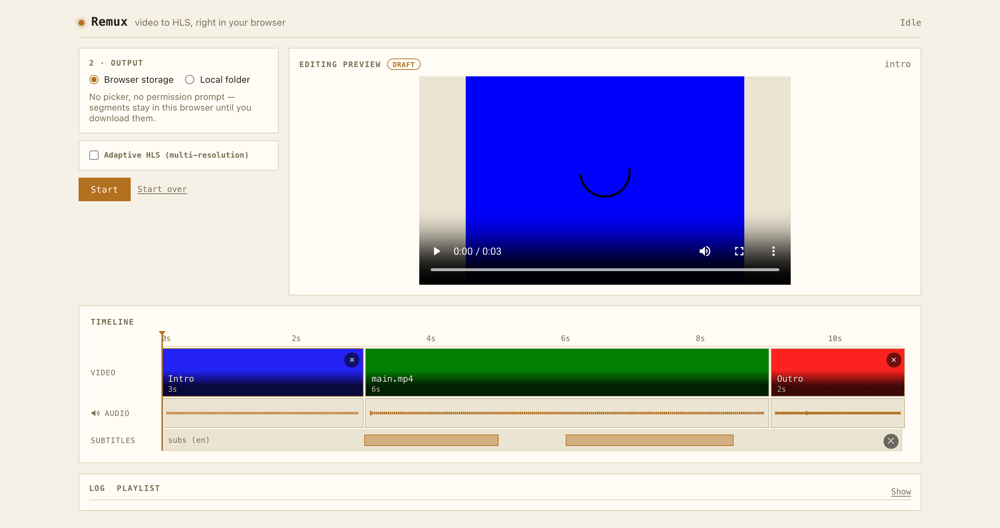

# Remux

[](https://github.com/pzanella/remux/actions/workflows/ci.yml)
[](https://pzanella.github.io/remux/)
[](LICENSE)

Turn a video into an HLS stream, right in your browser. No upload, no server,
no install.

**[Try it live →](https://pzanella.github.io/remux/)**



A drag-and-drop timeline for intro/outro clips and subtitles sits below the
preview, which itself shows a "Draft" edit while you're arranging clips and
swaps to the real Shaka Player-driven HLS result once you press Start.

## Why

Normally, converting a video to HLS means running FFmpeg on a server. Remux
does the same job inside the browser tab. For MP4 and MOV files, it copies
the existing video and audio into HLS segments — no re-encoding, so it is
fast and the quality does not change. For other formats, it uses FFmpeg
compiled to WebAssembly to convert the file first. Your video never leaves
your computer.

It has grown past a plain converter into a small in-browser packaging
pipeline: a timeline editor for stitching on intro/outro clips and subtitles,
and a Shaka Player-based result you can actually inspect — quality ladder,
subtitle tracks and all — instead of just a folder of files you have to trust.

## Features

- **Works with many formats** — MP4, MOV, MKV, WebM, AVI, WMV, FLV, and more.
- **Fast native path** — MP4/MOV files are remuxed by a small Rust program
  compiled to WebAssembly. No quality loss, no re-encoding.
- **Optional adaptive (multi-resolution) HLS** — generate a master playlist
  with 240p/360p/480p/720p renditions, picked in the UI. This mode re-encodes,
  using hardware acceleration when the browser supports it (see below).
- **In-browser timeline editor** — drag intro/outro clips and a subtitle file
  onto the timeline, or drop them straight from Finder/Explorer. Tracks are
  drawn proportional to real clip duration, with thumbnails and a waveform,
  and a draft preview plays intro → main → outro back to back (Space to
  play/pause) so you can check the cut before converting anything.
- **Subtitles** — attach a `.srt`/`.vtt` file, or double-click the subtitle
  track to write cues from scratch in a built-in editor. Shipped as a proper
  HLS sidecar track (`#EXT-X-MEDIA:TYPE=SUBTITLES`), selectable from the
  player's own subtitle menu.
- **Shaka Player result** — the final HLS output plays through
  [Shaka Player](https://github.com/shaka-project/shaka-player), with its
  stock quality/track selection UI, reading segments straight from disk (or
  browser storage) with no server involved.
- **Two output modes** — write straight to browser storage with no folder
  picker and download a ZIP when done, or pick a real folder on disk and
  watch segments land there as they're produced.
- **Crash recovery** — if the browser closes or crashes, you can pick up
  right where you left off. **Start over** resets everything for a new file.
- **Light on memory** — the file is never fully loaded into RAM, even for
  large videos.

## Project Structure

```
remux/
├── index.html
├── vite.config.ts
├── eslint.config.js
├── tsconfig.json
│
├── public/
│   └── coi-serviceworker.js    # supplies COOP/COEP on hosts that can't set headers (e.g. GitHub Pages)
│
├── wasm/                        # Rust crate, compiled to WebAssembly
│   ├── Cargo.toml
│   └── src/lib.rs                # reads MP4, writes MPEG-TS segments
│
├── packages/remux-core/         # `npm run build:wasm` output — a standalone,
│                                 # publishable package (gitignored, generated)
│
└── src/
    ├── main.tsx
    ├── App.tsx                   # puts the whole page together
    ├── index.css                 # all styles, no CSS framework
    │
    ├── components/
    │   ├── Timeline.tsx           # intro/outro/subtitle tracks, drag & drop, playhead
    │   ├── RawPreview.tsx         # draft preview during editing (plain <video>, no HLS yet)
    │   ├── Player.tsx             # final HLS result, via Shaka Player
    │   ├── SubtitleCueEditor.tsx  # in-browser WebVTT cue editor
    │   ├── Waveform.tsx           # canvas waveform for the audio track
    │   └── ...                    # one small job each
    ├── lib/
    │   ├── vtt.ts                 # WebVTT/SRT cue parsing, shared main-thread ⇄ worker
    │   ├── mediaPreview.ts        # client-side thumbnails + waveform peaks
    │   └── zip.ts                 # zips an output folder for download
    ├── hooks/
    │   ├── useTranscoder.ts      # runs the worker, tracks progress
    │   └── usePersistence.ts     # saves progress so you can resume later
    ├── worker/remux.worker.ts    # does the heavy work off the main thread
    └── types/
```

## Prerequisites

- [Node.js](https://nodejs.org/) `>=22.20.0` (this repo pins that version in
  `.nvmrc` — run `nvm use` if you have nvm)
- [Rust](https://rustup.rs/), installed with `rustup` (not Homebrew)
  ```bash
  curl --proto '=https' --tlsv1.2 -sSf https://sh.rustup.rs | sh
  rustup target add wasm32-unknown-unknown
  ```
- [wasm-pack](https://rustwasm.github.io/wasm-pack/installer/)
  ```bash
  cargo install wasm-pack
  ```

## Getting Started

```bash
git clone https://github.com/pzanella/remux.git
cd remux
npm install
npm run build:wasm   # compiles wasm/ and writes the output to packages/remux-core/
npm run dev          # starts the dev server at http://localhost:5173
```

Or run both build steps in one command:

```bash
npm run dev:full
```

Open the app, drop a video file onto the timeline, and press **Start** —
output goes to browser storage by default, no folder picker needed (see
[Output Modes](#output-modes)).

## npm Scripts

| Command | What it does |
| --- | --- |
| `npm run dev` | Start the dev server |
| `npm run build` | Type-check and build for production, into `dist/` |
| `npm run preview` | Serve the production build locally |
| `npm run build:wasm` | Rebuild the Rust crate |
| `npm run dev:full` | `build:wasm`, then `dev` |
| `npm run lint` | Check the code with ESLint |
| `npm run typecheck` | Check types without building |

## How It Works

1. **The file goes into OPFS** — a private, in-browser file system. It is
   streamed in small chunks, so even a 500 MB file does not fill up RAM.
2. **A Web Worker takes over.** If the file is not MP4/MOV, FFmpeg.wasm
   converts it to H.264 + AAC MP4 first.
3. **The Rust remuxer reads the video's headers** and works out where every
   segment should start and end, always at a keyframe.
4. **For each segment**, the worker reads the matching bytes from OPFS,
   hands them to Rust to build an MPEG-TS segment, and writes the result to
   the output location (see [Output Modes](#output-modes)). The playlist
   (`index.m3u8`) is updated after every segment, so the built-in player can
   start before the job is finished.
5. **Progress is saved to IndexedDB** after every segment. If something goes
   wrong, reopen the app and press **Resume**.

## Editing the Timeline

Before pressing Start, the timeline underneath the preview is a small
drag-and-drop editor:

- **Intro / outro** — drop a clip onto the "+ Intro"/"+ Outro" slot on
  either side of the main track. Tracks are drawn proportional to each
  clip's real duration, with thumbnails and a waveform, so the cut is
  visible before you commit to it. If a clip's own resolution or aspect
  ratio doesn't match the main content, it is letterboxed/pillarboxed to
  match (black bars, never stretched or cropped) — on the fast path and
  both Adaptive HLS paths alike.
- **Subtitles** — drop a `.srt`/`.vtt` file onto the subtitle track, or
  double-click the track to write cues from scratch in the built-in editor.
  Cues are authored relative to the main content; if an intro is attached,
  their timestamps are shifted forward automatically so they still land on
  the right moment in the final, spliced output. Cues that run past the end
  of the whole edit are flagged with a warning icon rather than silently
  clipped or left to overflow the timeline.
- **Preview vs. result** — the "Editing preview" above the timeline (marked
  **Draft**) plays intro → main → outro back to back in a plain
  `<video>` element, purely so you can check the cut — press Space to
  play/pause. It is not the packaged output. Press **Start** to actually
  remux/encode everything; the panel switches to the real HLS result,
  marked **Packaged**, played through Shaka Player.
- **Start over** clears the current file, timeline, and any in-progress
  session, so you can begin again from a clean slate.

## Output Modes

- **Browser storage** (default) — no folder picker, no permission prompt.
  Segments are written to a private, origin-scoped directory (OPFS) and
  stick around until you download them. Once a job completes, **Download as
  ZIP** bundles the whole output folder into one file.
- **Local folder** — pick a real folder on disk via the File System Access
  API; segments land there as they're produced, visible to any other
  program immediately.

Both modes support pause/resume and are read the same way by the built-in
player — only where the bytes end up differs.

## Adaptive (Multi-Resolution) HLS

Turn on **Adaptive HLS** in the rail and pick which renditions to generate —
240p, 360p, 480p, 720p. Renditions larger than the source are disabled
automatically (no upscaling).

Producing a genuinely different resolution means decoding and re-encoding,
something the fast path's Rust remuxer never does (it only copies existing
samples byte-for-byte). Adaptive HLS re-encodes — but rather than doing that
in software, it uses [WebCodecs](https://developer.mozilla.org/en-US/docs/Web/API/WebCodecs_API),
the browser's own hardware-accelerated encode/decode API, on browsers that
support it (Chrome/Edge 94+ — inside this project's normal requirement):

- **The source is decoded exactly once**, no matter how many renditions are
  selected, and fanned out to one hardware encoder per rendition — the
  Rust parser (the same one the fast path uses) reads the sample table,
  `VideoDecoder`/`AudioDecoder` decode it once, each rendition's
  `VideoEncoder`/`AudioEncoder` re-encodes from those same decoded frames.
  Video and audio samples are fed to their decoders interleaved, in
  chronological order, so audio for a given moment is always available by
  the time that moment's video segment gets cut — not decoded as two
  separate back-to-back passes.
- **No file duplication in memory.** Samples stream in from OPFS one at a
  time, the same way the fast path reads them — never the whole source
  buffered at once, and never once per rendition.
- **Hardware, not WebAssembly.** Encoding runs on the OS/GPU's codec instead
  of a single-threaded software encoder.
- **One rendition's trouble doesn't sink the others.** If a specific
  rendition's encoder hits trouble partway through — a real, occasionally
  observed hardware quirk on some machines — only that rendition is dropped;
  the rest finish and ship normally.
- **Edit-list aware.** Some real-world files carry a trailing chunk of
  encoded data that a QuickTime-style edit list marks as "not for playback"
  (often a partial frame left over from when recording stopped). The parser
  reads that boundary from either track and trims both to it, the same way
  a normal player would, instead of trying to decode content nothing else
  ever plays.

If WebCodecs isn't available, or the selected renditions' encoder configs
aren't supported on that machine, Remux automatically falls back to
FFmpeg.wasm — the same software path used for non-native container
conversion, so keeping it as a fallback doesn't add a new dependency, just
reuses one already there. FFmpeg fallback jobs encode renditions in parallel,
each in its own instance, at the cost of one full copy of the source per
rendition in memory. Neither path supports pause/resume for Adaptive HLS — a
restart begins the whole job over — but Cancel stops either one mid-flight.

The output folder gets one `.m3u8` and one set of `.ts` segments per
rendition (e.g. `480p.m3u8`, `480p_0000.ts`, ...), plus a `master.m3u8` that
lists them all with `#EXT-X-STREAM-INF` so any HLS player can switch between
them — the same output shape regardless of which path produced it.

## Reusing the Engine in Your Own Pipeline

The Rust remuxer that powers the fast path — MP4 header parsing, keyframe
segmentation, MPEG-TS muxing — is a self-contained crate (`wasm/`) with no
dependency on the rest of this app. `npm run build:wasm` compiles it and
writes a standalone, publish-ready npm package to `packages/remux-core/`
(gitignored, rebuilt from source — nothing to check in). This app consumes
that same package itself, from `src/worker/remux.worker.ts`, the same way an
external project would.

To use it outside this app:

```bash
npm run build:wasm
cd packages/remux-core && npm publish   # or `npm pack` to try it locally first
```

`npm run build:wasm` builds with `wasm-pack --target bundler`, so the
package expects a bundler that can import `.wasm` files as ES modules —
Vite with [`vite-plugin-wasm`](https://github.com/Menci/vite-plugin-wasm)
(what this app itself uses), or webpack with `asyncWebAssembly` enabled. For
a plain browser `<script type="module">` with no bundler, rebuild with
`wasm-pack build --target web` instead, which exports an async `init()` you
call yourself before using anything else.

With a bundler target, no init step is needed — importing the module is
enough (the crate has no Node-specific APIs; it reads whatever `Uint8Array`
you hand it):

```js
import { HlsProcessor } from 'remux-core';

const processor = new HlsProcessor();
processor.set_target_duration(6.0);

// `headerBytes` is however much of the front (or, for files without
// +faststart, the tail) of an MP4 you can read — enough to contain `moov`.
const { segmentCount, segments } = JSON.parse(processor.parse_headers(headerBytes));

for (let i = 0; i < segmentCount; i++) {
  const seg = segments[i];
  // Read the exact byte ranges `seg.videoSamples`/`seg.audioSamples`
  // describe from your source (see `readSamples` in remux.worker.ts for a
  // working reference) and hand them to the muxer:
  const tsSegment = processor.mux_segment(videoBytes, audioBytes, i); // Uint8Array
  // write tsSegment wherever you like — disk, network, IndexedDB…
}

const playlist = processor.generate_m3u8(JSON.stringify(durations));
```

`HlsProcessor` only ever holds one video + one audio track and always
produces MPEG-TS/HLS — that's the whole feature set today. There's no
generic multi-track API and no DASH/CMAF output.

## Supported Formats

| Format | Extensions | How it's handled |
| --- | --- | --- |
| MPEG-4 / QuickTime | `.mp4` `.mov` `.m4v` `.3gp` `.f4v` | Native Rust remux, no re-encode |
| Everything else | `.mkv` `.webm` `.avi` `.wmv` `.flv` `.ts` `.ogv` `.mpg` ... | FFmpeg.wasm converts it first |

## Good to Know

- Needs Chrome or Edge 108+, and either `localhost` or HTTPS.
- The server (or `vite preview`) must send two headers —
  `Cross-Origin-Embedder-Policy: require-corp` and
  `Cross-Origin-Opener-Policy: same-origin` — or the browser will refuse to
  open files the way Remux needs. `vite.config.ts` sets both for dev/preview;
  on hosts that can't set custom headers (like GitHub Pages),
  `public/coi-serviceworker.js` supplies them client-side instead.
- HEVC and AV1 video are not supported by the fast native path.
- The FFmpeg fallback downloads its engine (~32 MB) from a public CDN the
  first time it runs, then caches it for later sessions.
- Adaptive HLS's audio floor is 96 kbps, even for the 240p rung — Chrome's
  WebCodecs AAC encoder was found (empirically, against real stereo footage)
  to reliably fail to finish encoding stereo audio below that, regardless of
  source content or resolution.
- Subtitle files are sniffed by content, not trusted by extension — a `.vtt`
  that isn't actually WebVTT-shaped (a word processor's "export as .vtt" is
  a common way to end up with something else entirely) is run through
  FFmpeg as SRT instead of failing deep inside the player. If subtitles
  still don't show up, open the file in a plain text editor and check that
  it actually starts with `WEBVTT`.

## CI/CD

Every push and pull request runs through
[`.github/workflows/ci.yml`](.github/workflows/ci.yml): `cargo clippy` and
`cargo test` for the Rust crate, then building the Wasm module, `eslint`,
`tsc --noEmit`, and a production build. Pushes to `main` additionally deploy
`dist/` to GitHub Pages.

## Acknowledgments

- [FFmpeg](https://ffmpeg.org/) via [ffmpeg.wasm](https://github.com/ffmpegwasm/ffmpeg.wasm)
- [Shaka Player](https://github.com/shaka-project/shaka-player) for in-browser HLS playback
- [wasm-bindgen](https://github.com/rustwasm/wasm-bindgen) for the Rust ⇄ JS bridge
- [coi-serviceworker](https://github.com/gzuidhof/coi-serviceworker), vendored in
  `public/coi-serviceworker.js`, for cross-origin isolation on static hosts

## License

[MIT](LICENSE)
