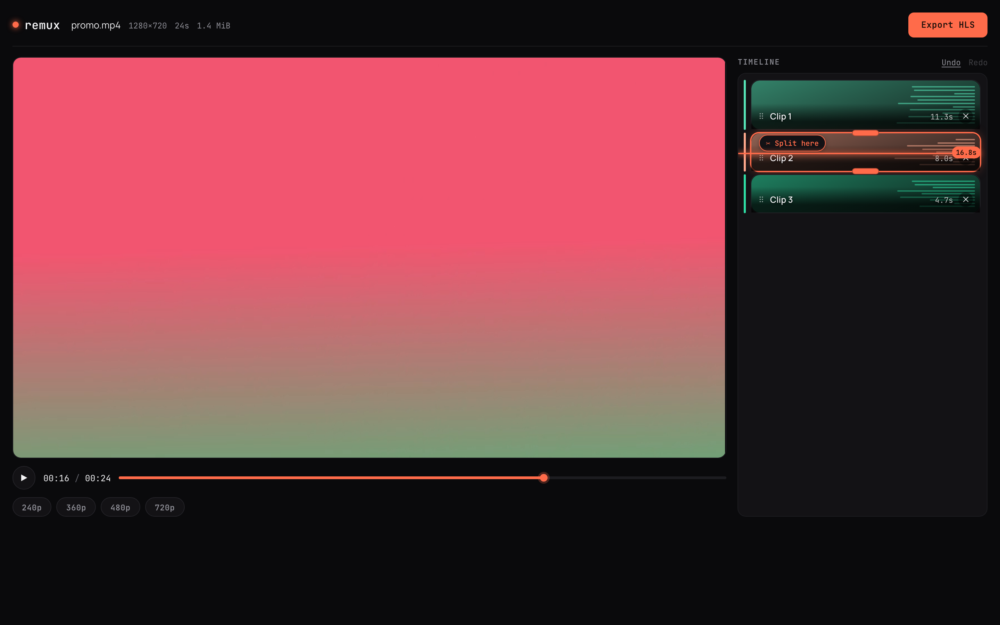

# Remux

[](https://github.com/pzanella/remux/actions/workflows/ci.yml)
[](https://pzanella.github.io/remux/)
[](LICENSE)

Turn a video into an HLS stream, right in your browser. No upload, no server,
no install.

**[Try it live →](https://pzanella.github.io/remux/)**



A vertical timeline for trimming, splitting, and reordering the clip sits
next to the preview, which itself shows a live draft while you're editing and
swaps to the real Shaka Player-driven HLS result once you press Start. A
persistent caption lane under the preview and an intro/outro-and-dub-audio
strip above the timeline are both visible throughout editing — not hidden
behind the "Export HLS" button, which now only opens a final review (output
destination, a recap of what's attached, renditions) before the job starts.

## Why

Normally, converting a video to HLS means running FFmpeg on a server. Remux
does the same job inside the browser tab. For MP4 and MOV files, it copies
the existing video and audio into HLS segments — no re-encoding, so it is
fast and the quality does not change. For other formats, it uses FFmpeg
compiled to WebAssembly to convert the file first. Your video never leaves
your computer.

It has grown past a plain converter into a small in-browser packaging
pipeline: a timeline editor for stitching on intro/outro clips and subtitles,
and a Shaka Player-based result you can actually inspect — quality ladder,
subtitle tracks and all — instead of just a folder of files you have to trust.

## Features

- **Works with many formats** — MP4, MOV, MKV, WebM, AVI, WMV, FLV, and more.
- **Fast native path** — MP4/MOV files are remuxed by a small Rust program
  compiled to WebAssembly. No quality loss, no re-encoding.
- **Optional adaptive (multi-resolution) HLS** — generate a master playlist
  with 240p/360p/480p/720p renditions, picked in the UI. This mode re-encodes,
  using hardware acceleration when the browser supports it (see below).
- **In-browser timeline editor** — trim, split, and reorder clips on a
  vertical rail, with a live draft preview (Space to play/pause, Ctrl/Cmd+Z
  to undo) so you can check the cut before converting anything.
- **Subtitles (multi-language)** — attach one or more `.srt`/`.vtt` files, or
  write cues from scratch, in the persistent caption lane under the preview.
  Cues render as blocks positioned against the real (possibly trimmed/split)
  timeline, not just raw timestamps — and a cue that no longer fits inside
  any current segment shows up as a warning right there, rather than only
  as a playback surprise later. Each track ships as its own
  `#EXT-X-MEDIA:TYPE=SUBTITLES` rendition, switchable from the player's own
  subtitle menu.
- **Intro / outro clips** — attach clips to splice onto the start/end of the
  output, from the collapsed "Intro/outro · Dub audio" strip above the
  timeline. Letterboxed/pillarboxed to match the main content's own
  dimensions if they don't already match.
- **Dub audio (multi-language)** — attach one or more alternate audio tracks
  from that same strip; each shipped as its own `#EXT-X-MEDIA:TYPE=AUDIO`
  rendition alongside the original, switchable from the player's own audio
  menu.
- **Shaka Player result** — the final HLS output plays through
  [Shaka Player](https://github.com/shaka-project/shaka-player), with its
  stock quality/track selection UI, reading segments straight from disk (or
  browser storage) with no server involved.
- **Two output modes** — write straight to browser storage with no folder
  picker and download a ZIP when done, or pick a real folder on disk and
  watch segments land there as they're produced.
- **Crash recovery** — if the browser closes or crashes, you can pick up
  right where you left off. **Start over** resets everything for a new file.
- **Light on memory** — the file is never fully loaded into RAM, even for
  large videos.

## Project Structure

```
remux/
├── index.html
├── vite.config.ts
├── eslint.config.js
├── tsconfig.json
│
├── public/
│   └── coi-serviceworker.js    # supplies COOP/COEP on hosts that can't set headers (e.g. GitHub Pages)
│
├── wasm/                        # Rust crate, compiled to WebAssembly
│   ├── Cargo.toml
│   └── src/lib.rs                # reads MP4, writes MPEG-TS segments
│
├── packages/remux-core/         # `npm run build:wasm` output — a standalone,
│                                 # publishable package (gitignored, generated)
│
└── src/
    ├── main.tsx
    ├── App.tsx                   # puts the whole page together
    ├── index.css                 # all styles, no CSS framework
    │
    ├── components/
    │   ├── VerticalTimeline.tsx   # segment trim/split/reorder rail, playhead
    │   ├── PreviewPane.tsx        # draft preview during editing (plain <video>, no HLS yet)
    │   ├── CaptionLane.tsx        # persistent subtitle-track lane under the preview
    │   ├── MediaExtrasPanel.tsx   # collapsed intro/outro + dub-audio strip
    │   ├── SubtitleCueEditor.tsx  # in-browser WebVTT cue editor
    │   ├── Player.tsx             # final HLS result, via Shaka Player
    │   ├── ExportModal.tsx        # final review (output/renditions) + progress + completion
    │   └── ...                    # one small job each
    ├── lib/
    │   ├── segments.ts            # pure split/trim/reorder/layout logic for the timeline
    │   ├── hls-playlist.ts        # pure HLS playlist-building + rendition geometry, shared with the worker
    │   ├── vtt.ts                 # WebVTT/SRT cue parsing, shared main-thread ⇄ worker
    │   ├── mediaPreview.ts        # client-side thumbnails + waveform peaks
    │   └── zip.ts                 # zips an output folder for download
    ├── hooks/
    │   ├── useTranscoder.ts       # runs the worker, tracks progress
    │   ├── useEditorSegments.ts   # owns the timeline's segment list, selection, undo/redo
    │   └── usePersistence.ts      # saves progress so you can resume later
    ├── worker/remux.worker.ts    # does the heavy work off the main thread
    └── types/
```

## Prerequisites

- [Node.js](https://nodejs.org/) `>=22.20.0` (this repo pins that version in
  `package.json`'s `engines` field — run `nvm install 22.20.0 && nvm use
  22.20.0` if you have nvm)
- [Rust](https://rustup.rs/), installed with `rustup` (not Homebrew)
  ```bash
  curl --proto '=https' --tlsv1.2 -sSf https://sh.rustup.rs | sh
  rustup target add wasm32-unknown-unknown
  ```
- [wasm-pack](https://rustwasm.github.io/wasm-pack/installer/)
  ```bash
  cargo install wasm-pack
  ```

## Getting Started

```bash
git clone https://github.com/pzanella/remux.git
cd remux
npm install
npm run build:wasm   # compiles wasm/ and writes the output to packages/remux-core/
npm run dev          # starts the dev server at http://localhost:5173
```

Or run both build steps in one command:

```bash
npm run dev:full
```

Open the app, drop a video file onto the timeline, and press **Start** —
output goes to browser storage by default, no folder picker needed (see
[Output Modes](#output-modes)).

## npm Scripts

| Command | What it does |
| --- | --- |
| `npm run dev` | Start the dev server |
| `npm run build` | Type-check and build for production, into `dist/` |
| `npm run preview` | Serve the production build locally |
| `npm run build:wasm` | Rebuild the Rust crate |
| `npm run dev:full` | `build:wasm`, then `dev` |
| `npm run lint` | Check the code with ESLint |
| `npm run typecheck` | Check types without building |

## How It Works

1. **The file goes into OPFS** — a private, in-browser file system. It is
   streamed in small chunks, so even a 500 MB file does not fill up RAM.
2. **A Web Worker takes over.** If the file is not MP4/MOV, FFmpeg.wasm
   converts it to H.264 + AAC MP4 first.
3. **The Rust remuxer reads the video's headers** and works out where every
   segment should start and end, always at a keyframe.
4. **For each segment**, the worker reads the matching bytes from OPFS,
   hands them to Rust to build an MPEG-TS segment, and writes the result to
   the output location (see [Output Modes](#output-modes)). The playlist
   (`index.m3u8`) is updated after every segment, so the built-in player can
   start before the job is finished.
5. **Progress is saved to IndexedDB** after every segment. If something goes
   wrong, reopen the app and press **Resume**.

## Editing the Timeline

The vertical rail next to the preview trims, splits, and reorders the main
clip before anything is exported:

- **Trim** — drag a selected clip's top/bottom handle to move its in/out
  point.
- **Split** — with the playhead inside a selected clip, a floating "Split
  here" control cuts it into two at that point.
- **Reorder** — drag a clip card to a new position in the stack.
- **Undo/redo** — Ctrl/Cmd+Z (+ Shift), or the buttons above the rail.
- **Preview vs. result** — the editing preview plays the trimmed/reordered
  cut in a plain `<video>` element, purely so you can check it before
  converting — press Space to play/pause. It is not the packaged output.
  Once a job starts, the panel switches to the real HLS result, played
  through Shaka Player.
- **Start over** (the logo/wordmark) clears the current file, timeline, and
  any in-progress session, so you can begin again from a clean slate.

## Extras: Subtitles, Intro/Outro, Dub Audio

Unlike the output/rendition choices reviewed in the "Export HLS" screen,
these three are attached from the main editing view itself — no need to
open the export screen just to see whether they're available.

- **Subtitles** — the caption lane under the preview. Attach one or more
  `.srt`/`.vtt` files with "+ Add captions", or "+ Write from scratch" to
  start a track with the built-in cue editor. Each track gets its own
  language field; the first attached becomes the player's default. Existing
  cues render as blocks positioned against the actual (possibly trimmed/
  split) output timeline, and "+ Cue" drops a new one in at wherever the
  playhead currently is, instead of typing a timestamp blind. Cues are
  authored in the *source file's own* time — the same time the cue editor
  and an attached `.srt`/`.vtt` both already use — and are automatically
  remapped into the edited output: a cue inside footage you've kept moves
  to its new position; a cue in footage that's been trimmed away, or that
  straddles a cut a split introduced, is dropped rather than shipped
  misaligned, and the lane shows a **⚠ N** count right on the track so
  that's visible while editing, not just in the export log. If an intro is
  attached, timestamps shift forward on top of that so cues still land
  alongside the right footage once it's spliced in front.
- **Intro / outro** — the collapsed "Intro/outro · Dub audio" strip above
  the timeline (click to expand). Attach a clip with "+ Intro"/"+ Outro";
  it's spliced onto the start/end of the output. If a clip's own resolution
  or aspect ratio doesn't match the main content, it is letterboxed/
  pillarboxed to match (black bars, never stretched or cropped) — on the
  fast path and both Adaptive HLS paths alike. Only native MP4/MOV-family
  clips are accepted (no FFmpeg pre-conversion step exists for these,
  unlike the main file).
- **Dub audio** — same strip. Attach one or more alternate audio tracks with
  "+ Dub audio track"; each gets its own language code (edit the field next
  to it) and becomes a switchable `#EXT-X-MEDIA:TYPE=AUDIO` rendition
  alongside the original. A dub shorter than the main content is rejected at
  attach time — every rendition in the group has to span the same duration.
- Dub-audio and intro/outro are mutually exclusive with each other, and with
  an edited (trimmed/split) timeline, for now — attaching an unsupported
  combination fails clearly at export time rather than producing broken
  output. Subtitles don't have this restriction — they're supported
  alongside an edited timeline, per the per-cue remap/drop behavior above.

## Output Modes

- **Browser storage** (default) — no folder picker, no permission prompt.
  Segments are written to a private, origin-scoped directory (OPFS) and
  stick around until you download them. Once a job completes, **Download as
  ZIP** bundles the whole output folder into one file.
- **Local folder** — pick a real folder on disk via the File System Access
  API; segments land there as they're produced, visible to any other
  program immediately.

Both modes support pause/resume and are read the same way by the built-in
player — only where the bytes end up differs.

## Adaptive (Multi-Resolution) HLS

Turn on **Adaptive HLS** in the rail and pick which renditions to generate —
240p, 360p, 480p, 720p. Renditions larger than the source are disabled
automatically (no upscaling).

Producing a genuinely different resolution means decoding and re-encoding,
something the fast path's Rust remuxer never does (it only copies existing
samples byte-for-byte). Adaptive HLS re-encodes — but rather than doing that
in software, it uses [WebCodecs](https://developer.mozilla.org/en-US/docs/Web/API/WebCodecs_API),
the browser's own hardware-accelerated encode/decode API, on browsers that
support it (Chrome/Edge 94+ — inside this project's normal requirement):

- **The source is decoded exactly once**, no matter how many renditions are
  selected, and fanned out to one hardware encoder per rendition — the
  Rust parser (the same one the fast path uses) reads the sample table,
  `VideoDecoder`/`AudioDecoder` decode it once, each rendition's
  `VideoEncoder`/`AudioEncoder` re-encodes from those same decoded frames.
  Video and audio samples are fed to their decoders interleaved, in
  chronological order, so audio for a given moment is always available by
  the time that moment's video segment gets cut — not decoded as two
  separate back-to-back passes.
- **No file duplication in memory.** Samples stream in from OPFS one at a
  time, the same way the fast path reads them — never the whole source
  buffered at once, and never once per rendition.
- **Hardware, not WebAssembly.** Encoding runs on the OS/GPU's codec instead
  of a single-threaded software encoder.
- **One rendition's trouble doesn't sink the others.** If a specific
  rendition's encoder hits trouble partway through — a real, occasionally
  observed hardware quirk on some machines — only that rendition is dropped;
  the rest finish and ship normally.
- **Edit-list aware.** Some real-world files carry a trailing chunk of
  encoded data that a QuickTime-style edit list marks as "not for playback"
  (often a partial frame left over from when recording stopped). The parser
  reads that boundary from either track and trims both to it, the same way
  a normal player would, instead of trying to decode content nothing else
  ever plays.

If WebCodecs isn't available, or the selected renditions' encoder configs
aren't supported on that machine, Remux automatically falls back to
FFmpeg.wasm — the same software path used for non-native container
conversion, so keeping it as a fallback doesn't add a new dependency, just
reuses one already there. FFmpeg fallback jobs encode renditions in parallel,
each in its own instance, at the cost of one full copy of the source per
rendition in memory. Neither path supports pause/resume for Adaptive HLS — a
restart begins the whole job over — but Cancel stops either one mid-flight.

The output folder gets one `.m3u8` and one set of `.ts` segments per
rendition (e.g. `480p.m3u8`, `480p_0000.ts`, ...), plus a `master.m3u8` that
lists them all with `#EXT-X-STREAM-INF` so any HLS player can switch between
them — the same output shape regardless of which path produced it.

## Reusing the Engine in Your Own Pipeline

The Rust remuxer that powers the fast path — MP4 header parsing, keyframe
segmentation, MPEG-TS muxing — is a self-contained crate (`wasm/`) with no
dependency on the rest of this app. `npm run build:wasm` compiles it and
writes a standalone, publish-ready npm package to `packages/remux-core/`
(gitignored, rebuilt from source — nothing to check in). This app consumes
that same package itself, from `src/worker/remux.worker.ts`, the same way an
external project would.

To use it outside this app:

```bash
npm run build:wasm
cd packages/remux-core && npm publish   # or `npm pack` to try it locally first
```

`npm run build:wasm` builds with `wasm-pack --target bundler`, so the
package expects a bundler that can import `.wasm` files as ES modules —
Vite with [`vite-plugin-wasm`](https://github.com/Menci/vite-plugin-wasm)
(what this app itself uses), or webpack with `asyncWebAssembly` enabled. For
a plain browser `<script type="module">` with no bundler, rebuild with
`wasm-pack build --target web` instead, which exports an async `init()` you
call yourself before using anything else.

With a bundler target, no init step is needed — importing the module is
enough (the crate has no Node-specific APIs; it reads whatever `Uint8Array`
you hand it):

```js
import { HlsProcessor } from 'remux-core';

const processor = new HlsProcessor();
processor.set_target_duration(6.0);

// `headerBytes` is however much of the front (or, for files without
// +faststart, the tail) of an MP4 you can read — enough to contain `moov`.
const { segmentCount, segments } = JSON.parse(processor.parse_headers(headerBytes));

for (let i = 0; i < segmentCount; i++) {
  const seg = segments[i];
  // Read the exact byte ranges `seg.videoSamples`/`seg.audioSamples`
  // describe from your source (see `readSamples` in remux.worker.ts for a
  // working reference) and hand them to the muxer:
  const tsSegment = processor.mux_segment(videoBytes, audioBytes, i); // Uint8Array
  // write tsSegment wherever you like — disk, network, IndexedDB…
}

const playlist = processor.generate_m3u8(JSON.stringify(durations));
```

`HlsProcessor` only ever holds one video + one audio track. Its main output
is still MPEG-TS/HLS via `mux_segment`, but it can also write fragmented-MP4
(CMAF-style) boxes: `init_segment_video`/`init_segment_audio` build the
`ftyp`+`moov` init segment for a rendition, and `mux_video_fragment`/
`mux_audio_fragment` build one `moof`+`mdat` fragment at a time from the
same segment data `mux_segment` already reads — video and audio always as
separate init segments/fragments, not a combined one, so a fragment stream
can be shared across renditions the same way this project's dub-audio
tracks already share one audio-only rendition across every video quality.
A WebCodecs-encoded (Annex-B) rendition gets the same treatment through
`init_segment_video_encoded`/`init_segment_audio_encoded` and
`mux_video_fragment_encoded`/`mux_audio_fragment_encoded` instead — same
box shapes, built from re-encoded chunks rather than bytes read straight
from a source file.

The app itself now uses all of this: the export screen's "Fragmented MP4
(experimental)" output option produces an `#EXT-X-MAP`-based HLS media
playlist referencing these init segments and `.m4s` fragments, *and* a
`manifest.mpd` DASH manifest describing the same files a second way (see
`src/lib/dash.ts`) — both for the plain single-quality fast path and for
adaptive (multi-rendition) HLS/DASH, each rendition with its own video
fragment stream sharing one audio fragment stream. Edited (trimmed/split)
segments, dub-audio, subtitles, intro/outro, and resume still only ever
produce MPEG-TS (the export screen fails clearly if you combine fMP4
output with any of those, rather than silently falling back), and adaptive
fMP4/DASH specifically needs WebCodecs hardware encoding — no FFmpeg
fallback exists for it, unlike adaptive MPEG-TS.

## Supported Formats

| Format | Extensions | How it's handled |
| --- | --- | --- |
| MPEG-4 / QuickTime | `.mp4` `.mov` `.m4v` `.3gp` `.f4v` | Native Rust remux, no re-encode |
| Everything else | `.mkv` `.webm` `.avi` `.wmv` `.flv` `.ts` `.ogv` `.mpg` ... | FFmpeg.wasm converts it first |

## Good to Know

- Needs Chrome or Edge 108+, and either `localhost` or HTTPS.
- The server (or `vite preview`) must send two headers —
  `Cross-Origin-Embedder-Policy: require-corp` and
  `Cross-Origin-Opener-Policy: same-origin` — or the browser will refuse to
  open files the way Remux needs. `vite.config.ts` sets both for dev/preview;
  on hosts that can't set custom headers (like GitHub Pages),
  `public/coi-serviceworker.js` supplies them client-side instead.
- HEVC and AV1 video are not supported by the fast native path.
- The "Fragmented MP4 (experimental)" output option produces both an
  HLS-on-fMP4 playlist and a DASH manifest, for the plain single-quality
  fast path and adaptive (multi-rendition) HLS/DASH alike — but not
  combined with an edited timeline, dub-audio, subtitles, intro/outro, or
  resume; the export fails clearly instead of silently falling back to
  MPEG-TS. Adaptive fMP4/DASH also needs a browser with WebCodecs hardware
  encoding — there's no FFmpeg fallback for it the way plain adaptive HLS has.
- The FFmpeg fallback downloads its engine (~32 MB) from a public CDN the
  first time it runs, then caches it for later sessions.
- Adaptive HLS's audio floor is 96 kbps, even for the 240p rung — Chrome's
  WebCodecs AAC encoder was found (empirically, against real stereo footage)
  to reliably fail to finish encoding stereo audio below that, regardless of
  source content or resolution.
- Subtitle files are sniffed by content, not trusted by extension — a `.vtt`
  that isn't actually WebVTT-shaped (a word processor's "export as .vtt" is
  a common way to end up with something else entirely) is run through
  FFmpeg as SRT instead of failing deep inside the player. If subtitles
  still don't show up, open the file in a plain text editor and check that
  it actually starts with `WEBVTT`.

## CI/CD

Every push and pull request runs through
[`.github/workflows/ci.yml`](.github/workflows/ci.yml): `cargo clippy` and
`cargo test` for the Rust crate, then building the Wasm module, `eslint`,
`tsc --noEmit`, `vitest run`, and a production build. Pushes to `main`
additionally deploy `dist/` to GitHub Pages.

## Acknowledgments

- [FFmpeg](https://ffmpeg.org/) via [ffmpeg.wasm](https://github.com/ffmpegwasm/ffmpeg.wasm)
- [Shaka Player](https://github.com/shaka-project/shaka-player) for in-browser HLS playback
- [wasm-bindgen](https://github.com/rustwasm/wasm-bindgen) for the Rust ⇄ JS bridge
- [coi-serviceworker](https://github.com/gzuidhof/coi-serviceworker), vendored in
  `public/coi-serviceworker.js`, for cross-origin isolation on static hosts

## License

[MIT](LICENSE) for this repository's own code, including the Rust crate in
`wasm/`. This does **not** cover the FFmpeg core Remux loads at runtime —
see below.

### Third-party licensing note: the FFmpeg core is GPL

`@ffmpeg/ffmpeg` and `@ffmpeg/util` (the JS wrapper libraries listed in
`package.json`, bundled into this app's own code) are MIT-licensed. The
actual FFmpeg engine — `@ffmpeg/core`, the compiled WebAssembly binary that
does the real encoding work — is a separate thing: **GPL-2.0-or-later**,
per its own [npm registry
entry](https://registry.npmjs.org/@ffmpeg/core). That's not an oversight on
ffmpeg.wasm's part — Remux's own code asks it to encode H.264 via libx264
(see `-c:v libx264` in `src/worker/remux.worker.ts`), and libx264 itself is
GPL, so any FFmpeg build capable of what this app actually does is GPL by
necessity.

In practice, this repository never bundles or redistributes that GPL
binary: `remux.worker.ts` fetches it live, at runtime, from a public CDN
(`unpkg.com`) that the ffmpeg.wasm project itself publishes to — the same
pattern as loading a script from a CDN `<script src>` tag. That's what
keeps this repo's own source (and its MIT license) clean today.

**Where this matters is monetization or redistribution.** If Remux is ever
packaged/sold as something that bundles the FFmpeg core itself — rather
than a browser fetching it live from ffmpeg.wasm's own CDN the way it does
now — that redistribution would be subject to GPL obligations, which
doesn't mix cleanly with a closed-source or purely-proprietary offering.
Whether *runtime-loaded, unmodified WebAssembly fetched from an
unaffiliated third party* even counts as GPL "linking" in the first place
is a genuinely unsettled question — see [this open issue on the
ffmpeg.wasm
repo](https://github.com/ffmpegwasm/ffmpeg.wasm/issues/902) raising exactly
that — so treat "we don't bundle it" as a reasonable current position, not
a guarantee. (This is a summary for engineering purposes, not legal advice
— get an actual license review before shipping a paid product built on
this.)

If GPL exposure ever needs to go away entirely, the concrete options are:
a commercial FFmpeg license (several vendors sell one), or a custom-built
LGPL-only ffmpeg.wasm core using [OpenH264](https://www.openh264.org/)
(BSD-licensed, Cisco-sponsored) instead of libx264 for the H.264 encode
path — no such LGPL build is currently published to npm by the
ffmpeg.wasm project, so this would mean compiling and hosting one
yourself, and accepting libx264's usual quality/speed edge over OpenH264.
